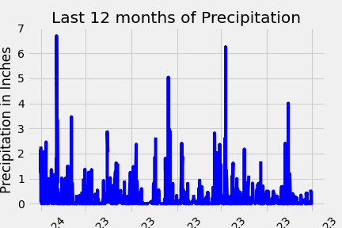
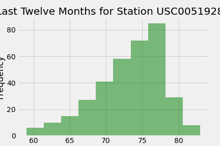

# sqlalchemy-challenge
For this project, I did some climate analysis on the Honolulu area. First, I used Python and SQLAlchemy to perform a basic analysis and data exploration of the provided database. Below are some graphs to represent the data. 

Once I completed this initial analysis, I designed a Flask API based on the queries that were developed in the first section of the analysis. If you'd like to run this file, the first route returns a dictionary of all of the date and precipitation values in the database. The second route shows the station names and the third route shows the date and temperature observations for the most active station in the data set from the last year. 

The last two routes will provide some descriptive values for the temperature history during a selected date range. Please choose a start and end (optional) date and input it in the following format: YYYY-MM-DD. The list returned will be the minimum, maximum and average temperatures for your requested range.

